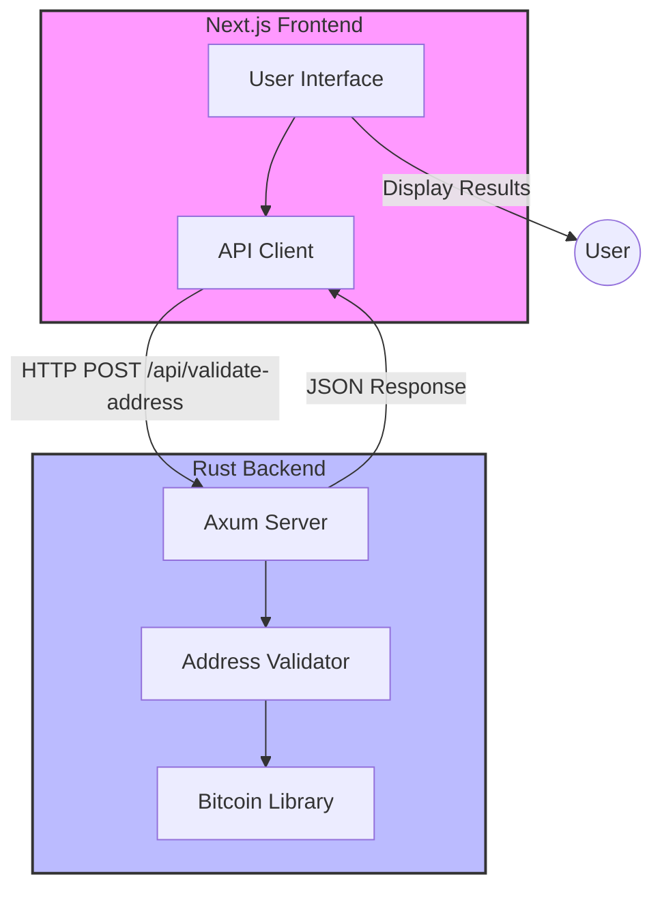

# Blockchain Tools

A full-stack application for blockchain-related utilities, starting with Bitcoin address validation.

## Architecture



## Project Structure

```
blockchain-tools/
├── backend/                 # Rust backend service
│   ├── src/
│   │   ├── main.rs         # HTTP server setup
│   │   └── lib.rs          # Core validation logic
│   └── tests/
│       └── address_validation.rs  # Integration tests
├── src/                    # Next.js frontend
├── public/                 # Static assets
└── package.json           # Frontend dependencies
```

## Features

- Bitcoin address validation
  - Supports multiple address formats:
    - Legacy addresses (P2PKH)
    - Script Hash addresses (P2SH)
    - Native SegWit addresses (Bech32)
  - Validates network type (mainnet only)
  - Returns address format and network information

## Getting Started

### Prerequisites

- Node.js 18+ and npm
- Rust and Cargo
- Git

### Running the Backend

1. Navigate to the backend directory:
   ```bash
   cd backend
   ```

2. Run the server:
   ```bash
   cargo run
   ```

The backend will start on http://localhost:3001.

### Running the Frontend

1. From the project root:
   ```bash
   npm install
   npm run dev
   ```

The frontend will be available at http://localhost:3000.

### Running Tests

#### Backend Tests

```bash
cd backend
cargo test                    # Run all tests
cargo test -- --nocapture    # Run tests with output
cargo test test_name         # Run a specific test
```

The test suite includes:
- Valid address format validation
- Network validation
- Invalid address handling
- Different Bitcoin address format support

#### Frontend Tests

```bash
npm test                     # Run all tests
npm run test:watch          # Run tests in watch mode
```

## API Documentation

### Validate Bitcoin Address

**Endpoint:** `POST /api/validate-address`

**Request:**
```json
{
    "address": "your_bitcoin_address"
}
```

**Response:**
```json
{
    "is_valid": true,
    "format": "P2pkh",
    "network": "bitcoin"
}
```

## Development

The project uses:
- Rust with Axum for the backend
- Next.js for the frontend
- Bitcoin-rs library for address validation
- Mermaid for documentation diagrams

## Contributing

1. Fork the repository
2. Create your feature branch (`git checkout -b feature/amazing-feature`)
3. Commit your changes (`git commit -m 'Add some amazing feature'`)
4. Push to the branch (`git push origin feature/amazing-feature`)
5. Open a Pull Request

## License

This project is licensed under the MIT License - see the LICENSE file for details.
